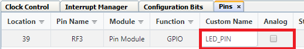
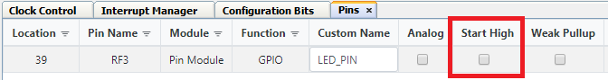

<!-- Please do not change this logo with link -->
[](https://www.microchip.com)

# Hello World

This example shows how to configure the LED on the PIC18F57Q43 Curiosity Nano to light up using drivers in MPLAB Code Configurator (MCC). The example uses the Pin Manager to configure the correct pin to be an output and to provide the correct output voltage for lighting the LED.

## Related Documentation

- [MPLAB Code Configurator](https://www.microchip.com/en-us/development-tools-tools-and-software/embedded-software-center/mplab-code-configurator)
- [PIC18-Q43 Family Product Page](https://www.microchip.com/en-us/products/microcontrollers-and-microprocessors/8-bit-mcus/pic-mcus/pic18-q43)

## Software Used

- [MPLAB® X IDE](http://www.microchip.com/mplab/mplab-x-ide) **5.45** or newer 
- [MPLAB® XC8](http://www.microchip.com/mplab/compilers) **2.31** or a newer compiler 
- [MPLAB® Code Configurator (MCC)](https://www.microchip.com/mplab/mplab-code-configurator) **4.1.0** or newer 
- [MPLAB® Melody Library](https://www.microchip.com/mplab/mplab-code-configurator) **1.37.24** or newer 
- [PIC18F-Q_DFP](https://packs.download.microchip.com/) **1.11.185** or newer Device Pack
## Hardware Used

- [Microchip PIC18F57Q43 Curiosity Nano Evaluation Kit](https://www.microchip.com/developmenttools/ProductDetails/DM164150)


## Setup

MCC with the Melody library was used to implement this example as shown in the following section.

### Pin Configuration
The Pin controlling the onboard LED on the Curiosity Nano board was configured using the Pins Grid View. The Pins Grid View is accessed by clicking on the Pins line in Project Resources.

*Project Resources*


Then the pin connected to the LED, RF3, was selected as an output by clicking the corresponding padlock symbol.

*Pins Grid View*


RF3 has both digital and analog capability the pin will have to be configured as digital only the analog checkbox is selected by default. The user must click the checkbox to deselect the analog function from the pin. The pin was also configured with a custom name to make the generated API more readable.

*Pins Tab*




Since the LED on the Curiosity Nano board is active low, that is, lighting up when the pin outputs a low voltage, the pin needs no further configuration. As seen below, the checkbox named "Start High" is not checked, so the pin starts with a low output.

*Start High Not Enabled*



The API is not needed in this application since the pin does not change, but if the user would like to configure it, the API makes it easy to reconfigure the pin in the code. For example, the code below could be used to toggle the output voltage of the pin from high to low or vice versa:

```c
LED_PIN_Toggle();
```

## Operation

After having flashed the application to the PIC18F57Q43 Curiosity Nano, the onboard LED is lit.

## Summary

The example has shown how MCC can be used to easily configure the pins of the PIC18F57Q43 device. 
